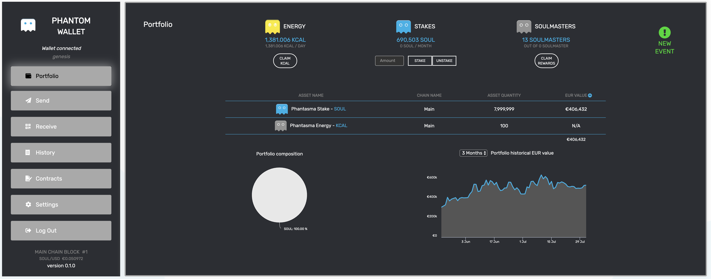

  

<h1 align="center">Phantom Wallet</h1>

  An extended light wallet for the <b>Phantasma</b> blockchain.

  
  

## Overview

### What is currently supported

- Creating a wallet
- Login with private key
- View wallet balance and smart contract balance (unclaimed KCAL, staked SOUL)
- View portfolio composition in percentage and view portfolio historical value
- Claim KCAL
- Stake and Unstake SOUL
- Claim Soulmaster rewards
- Send and receive SOUL, KCAL and any token on Phantasma
- View wallet transactions history
- Switch networks (Simnet/Testnet/Mainnet)
- Dark theme / Light theme mode
- Multi currencies supported (USD/CAD/EUR/etc.)
- Generic contract calls read and write, for all chain/sidechain, and all contracts on each of these chains

### Upcoming features

TODO

## Installation

TODO

### Required Tools and Dependencies

TODO
